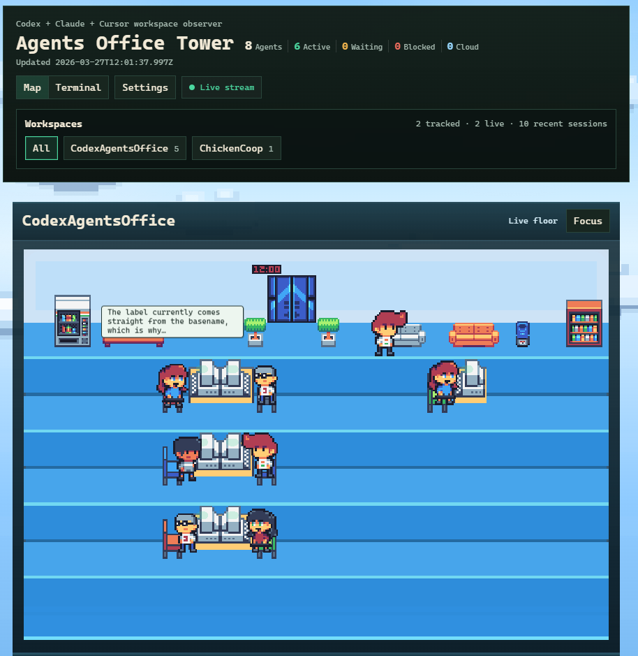

# Agents Office Tower

<div align="center">

### Live workload visibility for coding agents

Browser office view, terminal snapshot, and VS Code panel for current Codex, Claude, Cursor, and OpenClaw work.



[Quick start](#quick-start) • [Support matrix](#support-matrix) • [How it works](#how-it-works) • [Docs](#docs)

</div>

## What it is

- Workspace-level observability for active agent work.
- Focused on current workload, not transcript replay.

## What you get

- Browser office view with fleet mode and single-project focus.
- Adapter-first shared snapshot assembly with a static source registry for Codex, Claude, Cursor, OpenClaw, presence, and cloud integrations.
- A reserved multiplayer interface so a secured sync method can plug into the web surface later.
- Optional browser-side shared-room sync via PartyKit `host`, `room`, and short `nickname` settings.
- Terminal snapshot and watch mode.
- VS Code activity-bar panel.
- Current-workload-first scene with subtle recent history.
- Shared model across all renderers.
- External bundled browser assets under `packages/web/dist/client` instead of inline HTML script/style payloads.

Browser workload behavior:

- desks are for truly ongoing work plus a short top-level done cooldown of about 5 seconds
- the rec area holds recent resting lead sessions, not stale active-looking placeholders
- stale local `notLoaded` threads and completed process-only items like context compaction no longer count as active desk work after the turn has actually finished

## Support matrix

| Source | Project discovery | Live state | Typed approvals/input | Subagent correlation | Resume/open |
| --- | --- | --- | --- | --- | --- |
| Codex runtime (`codex app-server` via CLI or app) | V | V | V | V | V |
| Claude Agent SDK + hooks | V | basic | V | basic | X |
| Claude local transcripts only | V | inferred | X | X | X |
| Cursor local workspace state | V | inferred | X | X | X |
| Cursor cloud agents | V | cloud | X | basic | V |
| OpenClaw gateway | V | basic | X | basic | X |

## Quick start

### One line

From the cloned repo root:

```bash
npm start
```

That bootstraps the workspace if needed, rebuilds, and starts the web server on `http://127.0.0.1:4181`.

### Requirements

- Node.js and npm
- a cloned copy of this repo

### Optional integrations

- Codex CLI for the strongest local visibility
- Codex desktop app as an optional fallback runtime when the CLI is not installed
- On native Windows, a WSL-installed Codex CLI is also supported through `wsl.exe` when no Windows-side `codex.cmd` is available
- Claude local sessions for passive Claude visibility
- Claude hooks or Agent SDK bridge for stronger typed Claude visibility
- an installed Cursor app for inferred local Cursor visibility from workspace storage and logs
- `CURSOR_API_KEY` or a saved Cursor API key in the web Settings popup for Cursor cloud-agent visibility
- OpenClaw gateway access for OpenClaw visibility

### Run the web view

```bash
npm start
```

Open [http://127.0.0.1:4181](http://127.0.0.1:4181).

Local Cursor workspace sessions are inferred automatically when Cursor has opened the repo on this machine. For Cursor background-agent visibility, open `Settings` in the web header and save a Cursor API key once. The server stores that key in a machine-local app settings file outside the repo, and a process-level `CURSOR_API_KEY` still overrides the saved value when both are present.

Fleet mode is the default. For a focused single-project run:

```bash
npm start -- /abs/project/path --port 4181
```

To join a shared PartyKit room from the browser, open `Settings` and fill in:

- `Sharing`: toggle shared-room sync on or off without clearing the saved room credentials
- `Host`: your PartyKit deployment host such as `your-app.partykit.dev`
- `Room`: a shared room name such as `team/project-name`
- `Nickname`: an optional 12-character label shown on your remote agents

That room is the shared space. Anyone who enters the same `Host` and `Room` joins the same live sync channel. If saved credentials exist, sharing defaults to on until you toggle it off. The browser publishes all tracked workspace activity into that room and only renders remote workspace activity whose workspace name also exists locally.

Quick PartyKit hosting path:

1. Run the bundled relay locally with `npm run party:dev`
2. Deploy the bundled relay with `npm run party:deploy`
3. On first deploy, sign in with GitHub when the CLI prompts you
4. After provisioning, use the generated `partykit.dev` hostname in the app `Host` field

PartyKit’s docs say first deploys go to a hostname shaped like `[project-name].[github-username].partykit.dev`, and provisioning can take up to two minutes.
Official docs: [Quickstart](https://docs.partykit.io/quickstart/), [CLI](https://docs.partykit.io/reference/partykit-cli/), [Deploying](https://docs.partykit.io/guides/deploying-your-partykit-server/)

Optional dev check:

```bash
npm run typecheck
```

### Run the terminal view

Snapshot once:

```bash
node packages/cli/dist/index.js snapshot /abs/project/path
```

Watch live:

```bash
node packages/cli/dist/index.js watch /abs/project/path
```

### Run the demo

```bash
node packages/cli/dist/index.js demo preview --port 4181
```

### Run the VS Code panel

```bash
npm run build -w packages/vscode
```

Then open this repo in VS Code and press `F5`.

## How it works

The product normalizes everything into one shared workload model, then renders it in the browser, terminal, and VS Code.

Preferred sources:

- `codex app-server` for local Codex threads, approvals, turns, and notifications
- `codex cloud list --json` for cloud and web tasks
- Claude Agent SDK session APIs and Claude hook sidecars when available
- Claude local transcripts as fallback
- Cursor cloud-agent API
- OpenClaw gateway sessions

Important product rule:

- Codex is still the strongest integration surface today.
- Codex CLI is the preferred runtime. The desktop app is a fallback, not a requirement.
- Claude, Cursor, and OpenClaw are useful secondary sources.
- Provenance and confidence stay visible so inferred state does not look like typed state.

## Repo layout

- `packages/core`: shared discovery, adapter contracts, services, domain policies, rooms, appearance, and snapshot plumbing
- `packages/web`: browser server, render shell, and bundled client runtime
- `packages/cli`: `watch`, `snapshot`, demo, and web entrypoints
- `packages/vscode`: VS Code activity-bar integration
- `docs`: architecture, integration hooks, references, and priorities

## Docs

- [docs/spec.md](docs/spec.md): product and renderer expectations
- [docs/architecture.md](docs/architecture.md): system design and package boundaries
- [docs/integration-hooks.md](docs/integration-hooks.md): exact source surfaces and mappings
- [docs/self-development.md](docs/self-development.md): priorities and backlog
- [docs/references.md](docs/references.md): external references
- [CHANGELOG.md](CHANGELOG.md): notable shipped changes

## Notes

- The repo and package names still use `codex-agents-office` for now.
- The product name in the UI and docs is `Agents Office Tower`.
